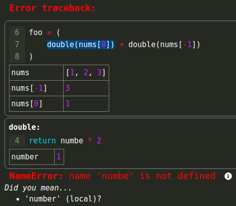

  

<h1 align="center"><code>futurecoder</code></h1>

This is a platform/course for people to teach themselves programming in Python, especially complete beginners at programming.

You can try it out here: https://futurecoder.io/

Currently this is a work in progress. While most of the groundwork is in place, there is a lot to do to make this a complete course ready for users. All kinds of help are needed and greatly appreciated - please consider [contributing](how_to_contribute.md)!

## Features

The course is a fully interactive 'book' which requires the user to run code in the provided editor or shell to advance:

The code at each step is checked automatically. Common mistakes can be caught and pointed out to the student. If needed, the student can get small hints to gradually guide them to the solution:

If they're still really stuck, they can reveal the solution bit by bit:

Tracebacks are more helpful than usual, highlighting the exact operation which failed and ensuring that the right amount of context is visible for multiline statements:

Several debuggers are provided, including [snoop](https://github.com/alexmojaki/snoop):

[birdseye](https://github.com/alexmojaki/birdseye):

and [Python Tutor](http://pythontutor.com/):

## Running locally

1. Fork the repository, and clone your fork.
2. If you want to run the system using Docker, which may be easier and will more closely resemble the production environment:
    1. Ensure you have docker and docker-compose installed.
    2. Create an empty file called `.env` in the repo root.
    3. Run `docker-compose up`.
    4. Skip the following two steps, everything should be running now.
3. In the `backend` folder:
    1. Ensure the `python` command points to Python 3.8.
    2. Run `./setup.sh`. This will:
        1. Install `poetry` if needed.
        2. Create a virtualenv and install Python dependencies.
        3. Create a sqlite database, run migrations, and create a user.
    3. Activate the virtualenv with `poetry shell`.
    4. Run the backend development server with `./manage.py runserver`.
4. In the `frontend` folder:
    1. Ensure you have recent versions of `node` and `npm`.
    2. Run `npm install` to download dependencies.
    3. Run `npm start` to start the frontend development server.
5. Go to http://localhost:3000/accounts/login/ and login with the email "admin@example.com" and the password "admin".
6. You should be redirected to http://localhost:3000/course/ and see the start of the course: "Introducing The Shell".

## Controls

The course consists of *pages* and each of them has a subject. When user open the website and click *Go to the Course*, they will be straightly led to the table of contents, where all pages are listed. User can choose any page whose subject is appealing to you to start from. User can also go back to TOC from each page by clicking *Table of Contents* in the menu. If your last page is anything but the first page, a link to that page is given at the top of the TOC to easily get back to where you were. Each page consists of *steps* and each step requires that the user runs some code that satisfies the requirements of that step. Once they succeed, they are shown the next step. Once they complete all the steps in a page, they are shown the "Next" button to move forward to the next page and the "Previous" button to review completed pages. Your progress on each page is recorded separately. Whenever you open a page, you are immediately on whichever step you reached previously. Besides, the page you move to is recorded as well. Opening simply `/course/` will take you to the page you were last on. Hopefully these basics (without the formal details) should become intuitively clear to the user as they try to use the site.

To explore the course more freely:

1. Click the hamburger menu icon in the top left.
2. Click Settings.
3. Turn Developer mode on.
4. This should give you two red buttons floating at the bottom of the screen. They change the currently active step, so you can move forward without having to complete exercises or backwards to test a step again.

At the beginning of the course only the shell is available to encourage quick exploration. After a few pages an editor is introduced to allow running full programs.

The course provides three debuggers to specially run code: snoop, PythonTutor, and birdseye. Each should only become available starting from a specific page which introduces that tool. No such page has been written yet for birdseye, so for now it's immediately available when the editor is introduced.
