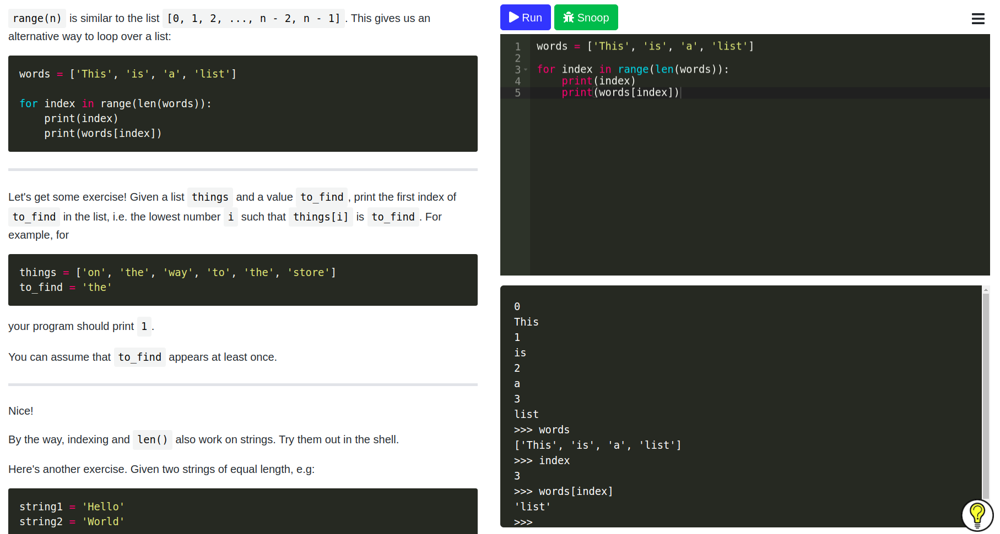
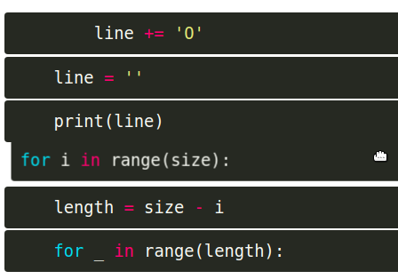
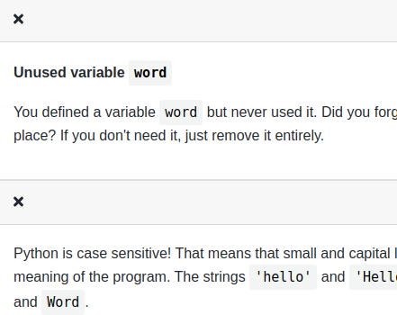

  

<h1 align="center"><code>futurecoder</code></h1>

This is a 100% free and interactive course for people to teach themselves programming in Python, especially complete beginners at programming.
It is carefully designed to reduce frustration and guide the user while still ensuring that they learn how to solve problems.
The goal is for as many people as possible to learn programming.

You can try it out here: https://futurecoder.io/

**Please consider [contributing](how_to_contribute.md) or [donating](https://opencollective.com/futurecoder)!**

Alternatively, [come have a chat on slack](https://join.slack.com/t/futurecoder/shared_invite/zt-tp8cmwra-CbdEeX9u3k1VyoMLDupAeQ).

## Features

For a fuller demonstration and explanation, [watch this video](https://www.youtube.com/watch?v=un1BrrV57PA&feature=youtu.be).

<table>
  <tr>
    <td colspan="2">
The course is a fully interactive 'book' which requires the user to run code in the provided editor or shell to
advance:
    </td>
  </tr>
    <tr>
    <td colspan="2">

    </td>
  </tr>
  <tr>
    <td>
This requires a mixture of solving problems or simply typing and running provided code. In the latter case, the
user is often kept engaged by being asked to predict the output in a simple multiple choice question:
    </td>
    <td>
The code at each step is checked automatically. If
needed, the student can get small hints to gradually guide them to the solution:
    </td>
  </tr>
  <tr>
    <td>

    </td>
    <td>

    </td>
  </tr>
  <tr>
    <td>
If they're still really stuck, they can reveal the solution bit by bit:
</td>
<td>

Or in some cases solve a *Parsons problem* instead, where they have to put a shuffled solution in the correct
order:
</td>
  </tr>
  <tr>
    <td>

</td>
<td>

</td>
  </tr>
  <tr>

<td>
Tracebacks are more helpful than usual, with several enhancements:

- Highlighting the exact operation that failed, not just the line, using [executing](https://github.com/alexmojaki/executing)
- Tables of local variables and simple expressions evaluated by [pure_eval](https://github.com/alexmojaki/pure_eval)
- Suggestions for fixes provided by [DidYouMean](https://github.com/SylvainDe/DidYouMean-Python)
- Beginner friendly explanations provided by [friendly-traceback](https://github.com/aroberge/friendly-traceback) (shown when hovering over the little `i` icon)
- Showing multiline statements in full thanks to [stack_data](https://github.com/alexmojaki/stack_data) without showing unnecessary extra lines

</td>
<td>
Common mistakes can be caught and pointed out to the student. This includes specific checks in some steps as well as linting tailored for beginners.
</td>
  </tr>
  <tr>

<td>

</td>
<td>

</td>
  </tr>
  <tr>
    <td>

Several debuggers are provided, including [snoop](https://github.com/alexmojaki/snoop)...
    </td>
    <td>

[...birdseye...](https://github.com/alexmojaki/birdseye)
    </td>
  </tr>
    <tr>
    <td>

    </td>
    <td>

    </td>
  </tr>
  <tr>
    <td colspan="2">

...and [Python Tutor](http://pythontutor.com/)
    </td>
  </tr>
  <tr>
    <td colspan="2">

    </td>
  </tr>
</table>

## Running locally

1. Fork this repo, `git clone` it, and enter the top-level `futurecoder` folder.
2. Install Python 3.10.2 and [poetry](https://python-poetry.org/docs/#installation).
3. Run `poetry install` to install Python dependencies.
4. Run `./scripts/generate.sh`. This will generate various static files from Python used by the frontend and run some tests. Repeat this step whenever you change Python files.
5. In the `frontend` folder:
    1. Install `node`. We recommend using version 14.15.4 (lts/fermium) but there are no known issues with other versions.

    2. Run `npm ci` to download dependencies.

    3. Run `npm run build` and then copy `service-worker.js` from the `course` folder to the `public` folder. The service worker is used by [sync-message](https://github.com/alexmojaki/sync-message) to handle `time.sleep` and reading from stdin (e.g. `input()`) in Python. If you want to enable caching (not a good idea when developing), set the environment variable `REACT_APP_PRECACHE=1` when building.

    4. Run `npm start` to start the frontend development server.
6. Go to http://localhost:3000/course/

To learn more about the system, see the [contributing guide](how_to_contribute.md).

## Controls

To explore the course more freely:

1. Click the hamburger menu icon in the top left.
2. Click Settings.
3. Turn Developer mode on.
4. This should give you two red buttons floating at the bottom of the screen. They change the currently active step, so you can move forward without having to complete exercises or backwards to test a step again.
